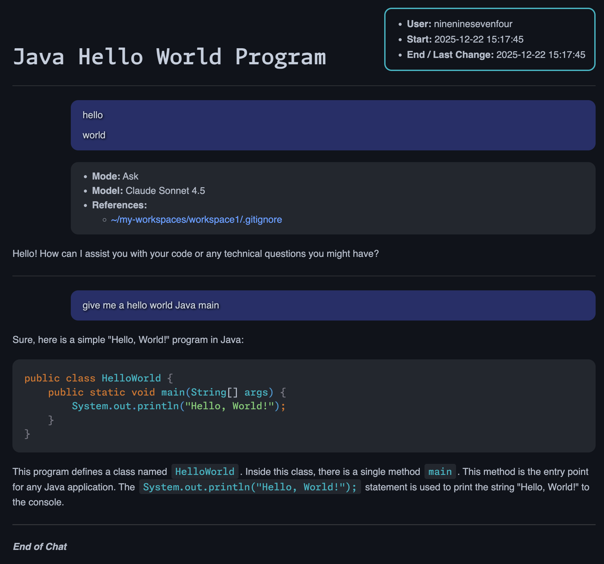

<style>
  blockquote:not(blockquote > blockquote), img {
    border-radius: 10px;
    border: 2px solid gray;
    box-shadow: 0 0 15px aqua;
  }
  img {
    border-radius: 10px;
    box-shadow: 0 0 15px aqua;
  }
  @media (prefers-color-scheme: light) {
    blockquote:not(blockquote > blockquote), img {
      box-shadow: 0 0 15px aquamarine;
    }
  }
</style>
# Copilot Chat Export (IntelliJ + Mac)

## Motivation

This Java program was created, because the [GitHub Copilot plugin for IntelliJ](https://plugins.jetbrains.com/plugin/17718-github-copilot--your-ai-pair-programmer) does not provide an export functionality (as of the time of writing).

## How it works

It scans the configuration files stored by the GitHub Copilot plugin under `~/.config/github-copilot` and tries to extract the contents.

## Notes & Disclaimer

* I do not take any warranty for damages caused by using this program. I tested it successfully multiple times, though.
* It might stop working at any time with updates of the GitHub Copilot plugin.
* It was tested for the GitHub Copilot **IntelliJ** plugin on **Mac**. It wasn't tested on Windows. Feel free to adapt it to your needs.
* The exported files will be written in a folder `chat-export` under the current folder, where the program is running. It creates markdown files named `YYYY-MM-DD_<Title_of_chat>.md`.
* It will _**overwrite**_ previously created files with the same name (this is intentional to be able to repeat the export multiple times), however if by chance there are two or more equally named chats from the same date found in the same run, they will receive a sequential number in the end and NOT be overwritten.
* It detects chats of mode "Ask" and "Agent". I think it does not support chats of mode "Edit" or "Plan".
* Empty chats are skipped.
* The user's chat message might not be 100% identical to the original due to some markdown reformatting.
* Chats of the currently open workspaces can not be exported, because those configrations are locked. There will be an error logged, which you can ignore.
* Older chats will probably not have the model name in the output.

## How to use

* Download the files of this Gist into a folder.
* Adapt to Maven outline:
  * Move the file CopilotChatExport.java to the subfolder src/main/java/com/example
  * Move the file chat_template.th to the subfolder src/main/resources
* Import as Maven project into the IDE of your choice.
* Compile and run.
* _Hint:_ Use a new workspace for running to be able to access all previous Copilot chats.

## Styled Template

There is a second template `chat_template_styled.th` in this Gist. It is optimized for dark mode.

To use it, either adapt method `exportChat` in the source code, or exchange it with `chat_template.th`.
If it works for you, will depend on the markdown viewer used (tested with IntelliJ and VSCode). 

## Sample Output

> # Java Hello World Program
> 
> * **User:** nineninesevenfour
> * **Start:** 2025-12-22 15:17:45
> * **End / Last Change:** 2025-12-22 15:18:57
> 
> ---
> 
> _**Request:**_
> 
> * **Mode:** Ask
> 
> > Hello
> 
> _**Response:**_
> 
> * **Model:** Claude Sonnet 4.5
> 
> * **References:** 
>   * [ ~/my-workspaces/workspace1/.gitignore](file:///Users/username/my-workspaces/workspace1/.gitignore)
> 
> * **Steps:**
>   * &#x2705; Collecting context
>   * &#x2705; Reading git information
>   * &#x2705; Analyzing problems and errors
>   * &#x2705; Reading runtime logs
>   * &#x2705; Generating response
> 
> Hello! How can I assist you with your code or any technical questions you might have?
> 
> ---
> 
> _**Request:**_
> 
> > Please give me a hello world Java main
> 
> _**Response:**_
> 
> Sure, here is a simple "Hello, World!" program in Java:
> 
> ```java
> public class HelloWorld {
>     public static void main(String[] args) {
>         System.out.println("Hello, World!");
>     }
> }
> ```
> 
> This program defines a class named `HelloWorld`. Inside this class, there is a single method `main`. This method is the entry point for any Java application. The `System.out.println("Hello, World!");` statement is used to print the string "Hello, World!" to the console.
> 
> ---
> 
> _**End of Chat**_

## Sample Output with Styled Template

 