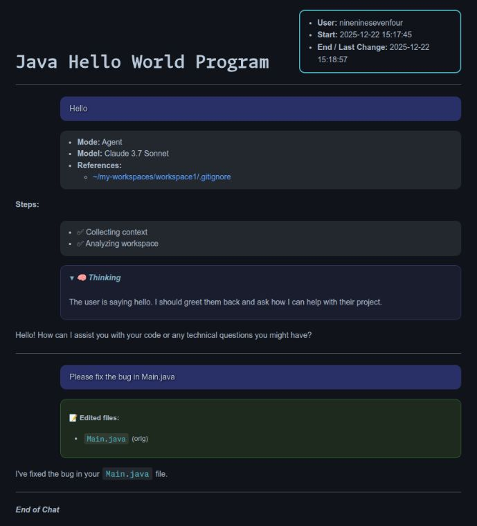

# Copilot Chat Export (IntelliJ + Mac)

## Motivation

This Java program was created because the [GitHub Copilot plugin for IntelliJ](https://plugins.jetbrains.com/plugin/17718-github-copilot--your-ai-pair-programmer) does not provide an export functionality (as of the time of writing).

This project is a fork of the original Gist by [nineninesevenfour](https://gist.github.com/nineninesevenfour/9e63ea6cbbf4c307814614ebd8e442e8) (raw: [URL](https://gist.githubusercontent.com/nineninesevenfour/9e63ea6cbbf4c307814614ebd8e442e8)), enhancing it with new features and improved usability.

## How it works

It scans the configuration files stored by the GitHub Copilot plugin under `~/.config/github-copilot` and tries to extract the contents, exporting each chat as a separate markdown file.

:warning: **Important:** It does not work for workspaces that are open! Every workspace you want to export the chats of must be closed beforehand!

## Data Structure

For detailed information about how Copilot stores its chat data and how this tool extracts it, see the [DATA_STRUCTURE.md](DATA_STRUCTURE.md) file (or [DATA_STRUCTURE_cs.md](DATA_STRUCTURE_cs.md) for the Czech version).

## Notes & Disclaimer

* I do not take any warranty for damages caused by using this program. I tested it successfully multiple times, though.
* It might stop working at any time with updates of the GitHub Copilot plugin.
* It was tested for the GitHub Copilot **IntelliJ** plugin on **Mac**. It wasn't tested on Windows. Feel free to adapt it to your needs.
* The exported files will be written into a folder `chat-export` under the current folder where the program is running. It creates three subfolders, `basic`, `detailed` and `styled`, each containing markdown files named `YYYY-MM-DD_<Title_of_chat>.md`.
* Files edited during the chat are extracted and saved into the `chat-export/_assets` folder, keeping both the original (pre-edit) and modified versions. The exported Markdown chats contain relative links to these local assets.
* It will _**overwrite**_ previously created files with the same name (this is intentional to be able to repeat the export multiple times); however, if by chance there are two or more equally named chats from the same date found in the same run, they will receive a sequential number in the end and NOT be overwritten.
* It detects chats of mode "Ask" and "Agent".
* It successfully extracts **Thinking steps**, **Edited files** (Working Set), **Error messages**, and **Ratings** (👍/👎).
* Empty chats are skipped.
* The user's chat message might not be 100% identical to the original due to some markdown reformatting.
* Chats of currently open workspaces cannot be exported because those configurations are locked. There will be an error logged, which you can ignore.
* Older chats will probably not have the model name or advanced steps in the output.

## How to Compile and Run

This project is a standard Maven project. You have multiple options to run it:

### Option 1: Using Maven Exec Plugin (Recommended)

You can compile and run the application directly using Maven from the project root:

```bash
mvn compile exec:java
```

To run the `DiagnosticDump` utility:

```bash
mvn compile exec:java -Dexec.mainClass="cz.lopin.copilotchatexport.DiagnosticDump"
```

### Option 2: Building a Standalone JAR (jar-with-dependencies)

You can build a "fat jar" containing all dependencies and run it:

```bash
mvn clean package
```

Then run the generated JAR file:

```bash
java -jar target/copilot-chat-export-1.0.1-SNAPSHOT-executable.jar
```

To run the `DiagnosticDump` utility from the JAR:

```bash
java -cp target/copilot-chat-export-1.0.1-SNAPSHOT-executable.jar cz.lopin.copilotchatexport.DiagnosticDump
```

### Option 3: From an IDE

1.  Open the project in your favorite IDE (like IntelliJ IDEA).
2.  Make sure all dependencies are downloaded by Maven.
3.  Navigate to the `cz.lopin.copilotchatexport.CopilotChatExport` class or `cz.lopin.copilotchatexport.DiagnosticDump` class.
4.  Run the `main` method.

_**Note:** The exported chats will be placed in the `chat-export` directory inside the folder where the program is executed._

## Basic, Detailed and Styled templates

The program now simultaneously generates three different versions of each chat:
1. `chat-export/basic/...` using `chat_template_basic.th` - standard markdown, prompts and replies only.
2. `chat-export/detailed/...` using `chat_template_detailes.th` - standard markdown, with additional info like changed files, thinking sections, etc.
3. `chat-export/styled/...` using `chat_template_styled.th` - enhanced HTML/Markdown hybrid, optimized for dark mode with custom fonts, collapsible thinking steps, and distinct styling for code edits and errors.

Whether the styled template looks good will depend on the markdown viewer used (tested with IntelliJ and VSCode).

## Dependencies Used

* [Nitrite Database](https://nitrite.dizitart.com/index.html)
* [H2 Database MVStore](https://www.h2database.com/html/mvstore.html)
* [Thymeleaf Templates](https://www.thymeleaf.org/)
* [Jackson Databind](https://github.com/FasterXML/jackson-databind)
* [SLF4J Simple Provider](https://www.slf4j.org/manual.html)


## Sample output of Basic template

> # Java Hello World Program
> 
> * **User:** nineninesevenfour
> * **Start:** 2025-12-22 15:17:45
> * **End / Last Change:** 2025-12-22 15:18:57
> 
> ---
> 
> _**Request:**_
> 
> * **Mode:** Ask
> 
> > Hello
> 
> _**Response:**_
> 
> * **Model:** Claude Sonnet 4.5
> 
> * **References:** 
>   * [ ~/my-workspaces/workspace1/.gitignore](file:///Users/username/my-workspaces/workspace1/.gitignore)
> 
> * **Steps:**
>   * &#x2705; Collecting context
>   * &#x2705; Reading git information
>   * &#x2705; Analyzing problems and errors
>   * &#x2705; Reading runtime logs
>   * &#x2705; Generating response
> 
> Hello! How can I assist you with your code or any technical questions you might have?
> 
> ---
> 
> _**Request:**_
> 
> > Please give me a hello world Java main
> 
> _**Response:**_
> 
> Sure, here is a simple "Hello, World!" program in Java:
> 
> ```java
> public class HelloWorld {
>     public static void main(String[] args) {
>         System.out.println("Hello, World!");
>     }
> }
> ```
> 
> This program defines a class named `HelloWorld`. Inside this class, there is a single method `main`. This method is the entry point for any Java application. The `System.out.println("Hello, World!");` statement is used to print the string "Hello, World!" to the console.
> 
> ---
> 
> _**End of Chat**_


## Sample Output of Detailed template

> # Java Hello World Program
>
> * **User:** nineninesevenfour
> * **Start:** 2025-12-22 15:17:45
> * **End / Last Change:** 2025-12-22 15:18:57
>
> ---
>
> > Hello
>
> * **Mode:** Agent
> * **Model:** Claude 3.7 Sonnet
>
> * **References:**
>   * `~/my-workspaces/workspace1/.gitignore`
>
> **Steps:**
> * &#x2705; Collecting context
> * &#x2705; Analyzing workspace
>
> **Thinking:**
> > The user is saying hello. I should greet them back and ask how I can help with their project.
>
> Hello! How can I assist you with your code or any technical questions you might have?
>
> ---
>
> > Please fix the bug in Main.java
>
> 📝 **Edited files:**
> * [`Main.java`](../_assets/2025-12-22_Java_Hello_World_Program/Main.java) ([orig](../_assets/2025-12-22_Java_Hello_World_Program/Main.orig.java))
>
> I've fixed the bug in your `Main.java` file.
>
> ---
>
> _**End of Chat**_

## Sample Output of Styled Template

[](./doc/example_styled_output.md)
